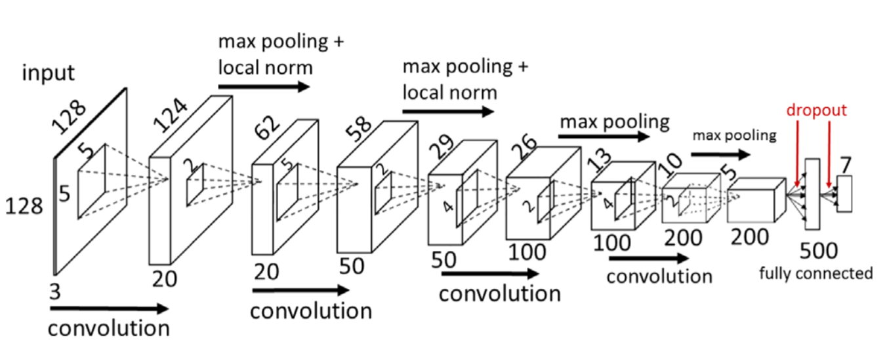

# Bacterial colony counting with Convolutional Neural Networks in Digital Microbiology Imaging

__Authors:__ Alessandro Ferrari, Stefano Lombardi, Alberto Signoroni

__Published: __7 July 2016

__Available at:__ http://www.sciencedirect.com/science/article/pii/S0031320316301650?via%3Dihub

## Summary
This paper describes a large dataset useful for training and testing cell colony counters, as well as a convolutional neural net architecture that the authors optimized for the task.

## Dataset
### Collection
The dataset is of plates from clinical urine samples. Photos were taken using a high-resolution line camera, a multiple lighting system, and a sample conveyor. The resulting photos are 4000px by 4000px. Lighting has been set up to produce helpful reflections on the colonies. Photos are taken at time $0$ and at time $N$. There is some class skewness, which has been partially compensated for.

### Preprocessing

1. _Matching:_ The time $0$ images are matched to the time $N$ images.
2. _Subtraction:_ The time $0$ images are subtracted from the time $N$ images, yielding backgroundless time $N$ images.
3. _Segmentation:_ Some work is done to segment the backgroundless time $N$ images into rectangualr segments, where each segment has a group of agglomerate colonies (or a single colony, if you are lucky). The segments are of various dimensions, as the colony group sizes vary from 0.1mm^2^ to 3cm^2^.
4. _Squaring_: Given a rectanglular segment, replace it with a square segment with the same center and side length $\max(W, H)$.
5. _Padding:_ Pad each segment by some fixed amount.
6. Resizing:_ The segments are resized to 128px by 128px. The consistent size makes it easy to use neural nets. Various sizes have been tested and this size strikes the best balance between accuracy and speed.
7. _(Optional) Cleaning:_ When segmenting the image into groups, we obtained a mask for each group. Clean each segment by replacing all pixels outside of a bounding box around the mask with the corresponding pixels at time $0$. Or, go further and replace all pixels ouside of the mask with black. This type of preprocessing worked best for the authors, and is used as the baseline.

### Labeling

The segments are given labels from $\{1, 2, 3, 4, 5, 6, \text{outlier}\}$. The outlier class is for segments containing debris instead of colonies. Segments with seven or more colonies, which are very rare, are removed from the dataset because they are confluences, and this experiment does not seek to deal with confluences.

### Augmentation

Various methods of augmentation are attempted.

- All segments are flipped horizontally to produce a new segment. Vertical flips are not used because they do not keep the reflection at the bottom of the colonies, thus degrading performance.
- All segments get three different color distortions applied to produce three new segments.
- All segments get zoomed to 85% and 115% before cropping to produce two new segments.
- A combination of horizontal flips and rescalings, producing six new segments for each original segment.

### Normalization

- Contrast Limited Adapative Histogram Equalization
- Orientation normalization (reduced accuracy)

## Network

The convolutional neural network used has five learned layers.

1. Convolutional: 20 filters, window 5px
2. Convolutional: 50 filters, window 5px
3. Convolutional: 100 filters, window 4px
4. Convolutional: 200 filters, window 4px
5. Fully connected: 500 units
6. Softmax: 7 units

The ReLU activation function was chosen beacuse it is non-saturating and therefore speeds up training. Local Response Normalization is applied to the outputs of the convolutional layers. The max-pooling that follows is non-overlapping. Random dropout (tuned to 75% of the weights using cross-validation) is used on the fully connected layers to reduce overfitting. Weights are initially drawn from $U[-\sqrt{\frac{3}{fan_in}}, \sqrt{\frac{3}{fan_in}}]$ and biases are initially some constant. Optimization is via Stochastic Gradient Descent with batch size $64$, weight decay rate $0.0005$, learning rate $0.01$, learning rate decay rate $0.0001$, and momentum $0.9$. The learning rate was halved at iterations $20,000$ and $40,000$. 30% of the data is set aside for testing. Of the remaining training data, 30% is set aside for validation, before being included for final training. The testing data is kept consistent for the various models.

## Performance

- Without enhancement, the CNN applied to the masked data yielded 91.5% accuracy.

  - Resizing improves accuracy by 0.5%.
  - Color distortations do not improve accuracy.
  - Contrast Limited Adapative Histogram Equalization does not improve accuracy.
  - Flipping improves accuracy by 0.6%.
  - Combination of flipping and resizing worsens accuracy, the authors suspect due to "increased noise in the classifier".
  - Orientation normalization worsens accuracy, due to the practical fact that the reflections are no longer on bottoms of the colonies after this transformation.

- The CNN applied to the bounding box dataset yielded 90.5% accuracy, due to traces of nearby colonies producing noise.

- $30,000$ iterations are enough for stabilization of the test error. $50,000$ take about an hour on an Nvidia Titan X GPU.

- The confusion matrix shows that errors are "nearby" in the sense that a group of $5$, if misclassified, is probably classified as $4$ or $6$.

- Outlier detection was effective.

- The most common errors involve a tiny colony and a larger one. The tiny colony is probably ignored as noise.

- The net was compared to an SVM with handmade colorimetric and morphometric features and performed better.

  ​

  ​